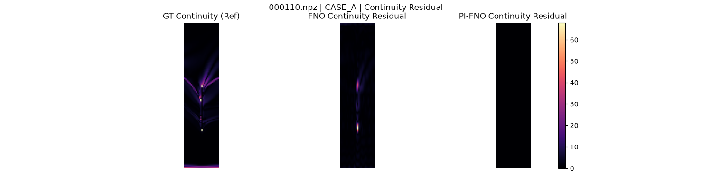
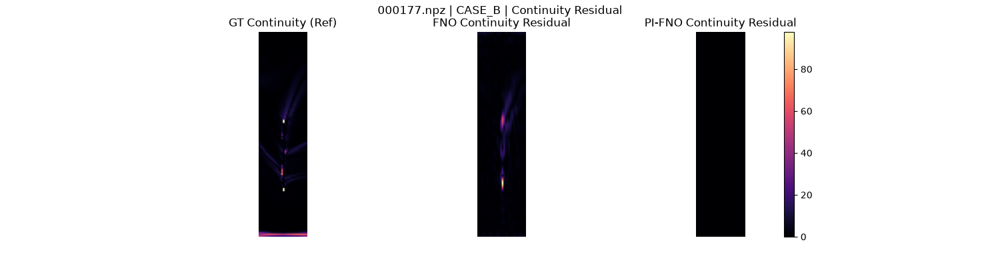
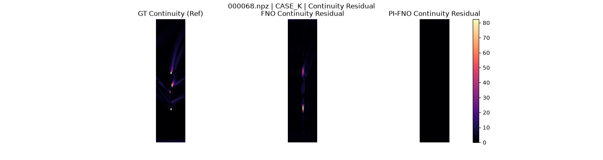

# Physics-Informed Neural Operators for Flow Field Prediction

Neural operators can predict aerodynamic flow fields significantly faster than conventional Computational Fluid Dynamics (CFD) solvers. However, low overall field error does not necessarily guarantee that predictions are physically consistent. This project investigates whether adding a **continuity-based physics regularization term** to a **Fourier Neural Operator (FNO)** can reduce local physical inconsistencies when predicting flow over **unseen blade geometries**.


## The Engineering Problem

Purely data-driven surrogate models (like a standard FNO) minimize global structural error (Relative $L_2$ against CFD ground-truth) but remain entirely unaware of the underlying physics. As a result, they often produce velocity fields that violate local continuity (conservation of mass), especially when extrapolating.

By explicitly penalizing non-physical divergence during training, a Physics-Informed FNO (PI-FNO) forces the network to respect fluid dynamics equations. The core question is whether this physics regularization can improve physical consistency without causing an unacceptable loss of predictive accuracy.

## What I Built

I developed a controlled comparison between a baseline FNO and a PI-FNO. The pipeline covers geometry preprocessing, model implementation, and blind evaluation.

To ensure the results were reliable, I kept the experimental protocol strictly separated:
- **100** geometries for training
- **25** geometries for validation (used exclusively to select the physics regularization weight, $\lambda$)
- **50** geometries for held-out testing

The regularization strength ($\lambda = 1.0$) was selected on the validation set before any models were evaluated on the 50 held-out test geometries, ensuring the final metrics reflect true generalization.

## Final Results

The physics regularization successfully corrected the structural flow violations at the cost of a minor accuracy trade-off.

| Model | Relative L2 | Continuity Residual |
|-------|-------------|---------------------|
| FNO | 0.1558 | 1.5468 |
| PI-FNO | 0.1594 | 0.0225 |

**Key Findings:**
- The PI-FNO reduced the defined local continuity residual by **98.5%** on the held-out test set.
- **100% (50/50)** of the test geometries showed strictly improved physical continuity.
- The global accuracy trade-off for enforcing this physics constraint was **+0.0036** in Relative $L_2$.

### Low-Data Behavior
I also investigated how the models perform when data is heavily constrained (N=25 training geometries). Under data scarcity, the mean accuracy penalty for using the PI-FNO shrank to approximately 0.00175, suggesting that physics-informed constraints become increasingly valuable when data is limited.

## Visual Comparison

### 1. Representative Median Case

The PI-FNO retains the macro flow features while actively suppressing the unphysical high-frequency artifacts that appear in the baseline FNO's continuity residual field.

### 2. High Continuity Improvement

In challenging boundary configurations, the baseline FNO struggles profoundly with physical consistency. The PI-FNO massively regularizes the field, eliminating the chaotic residual violations.

### 3. Optimal Trade-off

In many cases, the PI-FNO suppresses the continuity residual without inducing any visually perceptible loss in structural accuracy.

## Reproducibility

The complete training, validation, and testing lifecycle was executed locally on standard workstation hardware (AMD Ryzen 7 6800H, RTX 3050 Ti 4GB, PyTorch 2.5.1).

**Quick Environment Check:**
```bash
python scripts/train_and_evaluate.py --smoke-test
```

**Dataset Acquisition:**
```bash
python scripts/download_data.py  # Prints instructions
```

**Full Execution:**
```bash
python scripts/train_and_evaluate.py --config configs/pifno.yaml
```

**Optional Low-Data Study:**
```bash
python scripts/train_and_evaluate.py --config configs/pifno.yaml --run-low-data
```

## Limitations
- **Local Continuity vs. Global Mass Conservation**: The implemented continuity residual acts as a local physics regularizer. It does not guarantee exact global mass conservation across the entire domain.
- **Accuracy Penalty**: The PI-FNO incurs a small but measurable (+0.0036) Relative $L_2$ penalty compared to the unconstrained model. It is not a direct CFD substitute.
- **Dataset Regime**: These findings apply specifically to the evaluated BladeNet geometric dataset regime (128x32x16 grids).

## Dataset Attribution
The dataset utilized in this repository originates from the `lrwei/bladenet` collection hosted on HuggingFace.

## Technical Report

A detailed technical report covering the motivation, methodology, experimental protocol, results, discussion, and limitations of this investigation is available here:

[Read the Technical Report (PDF)](docs/reports/physics_informed_fno_technical_report.pdf)

## Contributors

- [Tanish Shetty](https://github.com/Tanish0224)
- [Vishal UC](https://github.com/VISH-104)
- [Tushank Bisht](https://github.com/tushankb07)
